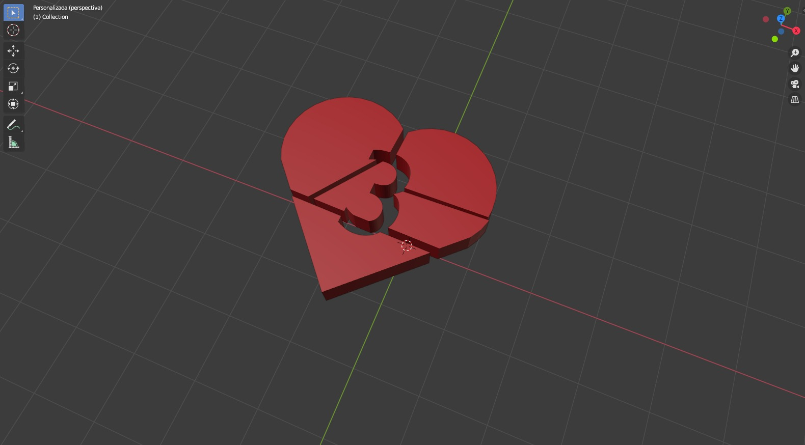

# Escape Room 

Eduardo Díaz Hernández

Sergio Guerra Arencibia

Esther Jorge Paramio

## Descripción

En este proyecto se ha desarrollado una aplicación de Realidad virtual para *Google CardBoards*. 

Hemos elegido desarrollar un juego basado en un *scape room* en el que se tiene que escapar de una cabaña realizando diferentes puzzles, desde puzzles deslizantes hasta laberintos. También hay que resolver enigmas o cuestiones interactuando con el medio.

## Historia 

El jugador se despierta aturdido y sin recuerdos de lo que ha pasado teniendo el único pensamiento de que tiene que salir cuánto antes. Una persona cuya identidad al principio se desconoce, la ha encerrado para poner a prueba la poca cordura, que a nuestro personaje, le queda. 

Esta pequeña introducción se le muestra al jugador mediante un vídeo introductorio para luego empezar a jugar dentro de la cabaña.

Una vez que el jugador haya conseguido introducir la clave correcta y escapar, se muestra otro pequeño corto en el que se le acaba de explicar la poca historia que quedaba por descubrir.

Una psicópata que había escapado de la cárcel por dedicarse a torturar psicológicamente a sus víctimas hasta dejarlas sin un ápice de cordura, decidió probar nuevos métodos para poner al límites a las personas. En este caso, encerrándolas y poniéndolas a realizar puzzles bajo presión con la esperanza de que los acabarán todos antes de que ella llegue a la cabaña.

## Cuestiones importantes para el uso

Para el uso del programa, es importante disponer de un mando que disponga de un joystick y uno o más botones. El joystick permitirá el movimiento del personaje y el botón la interacción con el entorno. Además se necesitará (obviamente) unas gafas VR ya que es un juego de realidad virtual.

La interacción con el juego se realizará haciendo uso de la retícula y los botones del mando para interactuar con los objetos del entorno. Es importante destacar que, cuando un objeto es interactivo se indica con la retícula, es decir, cuando el jugador mira a un objeto interactivo la retícula se expande para indicar la funcionalidad. 

La interacción se detecta mediante el uso de *RayCast*, permitiéndonos detectar si el usuario está mirando a dicho objeto. En esta situación, si se pulsa el botón correspondiente al de aceptar se activa la respectiva acción que tiene que ver con dicho objeto de forma automática.

Adicionalmente, por comodidad de desarrollo el juego también admite como controles el teclado y ratón. Esto es principalmente para que posible interactuar con el juego mediante la interfaz de *unity* desde el ordenador.

## Hitos de programación aplicando lo dado en clase

En primer lugar, hemos logrado el desarrollo de una aplicación en realidad virtual que es cómoda y se adapta a las necesidades del usuario. Esto es importante destacarlo ya que a la hora de desarrollar una aplicacion de este tipo hay que tener en cuenta varias características importantes.  
  - Uso del menú para permitir al usuario iniciar el juego cuando él decida, nunca automáticamente.
  - Velocidad constante en el juego, evitando discrepancias entre la percepción virtual y real.
  - Uso de la retícula para proporcionar información (indicando si un elemento es interactuable por ejemplo).
  - Transiciones entre escenas de manera progresiva para evitar la pérdida del seguimiento de cabeza.  
  
Adicionalmente, se han implementado diferentes mecánicas impartidas en clase más orientados a la programación que a la realidad virtual.

- Uno de los más importantes es el uso de delegados. Sabemos que este es un recurso aplicado a estas situaciones donde un elemento necesita interactuar con dos o más. De esta forma, hemos simplificado la interacción entre elementos en situaciones donde, por ejemplo, debemos encender un conjunto de luces a partir de un solo interruptor.  
- Respecto los sensores explicados en clase hemos incluido el uso de la brújula. El objetivo de este sensor dentro del juego es permitir al jugador a relacionar direcciones con colores, dando así el conocimiento para resolver uno de los engimas planteados.
- También, hemos aplicados los conocimientos enseñados sobre las físicas y las colisiones en *unity*. Las paredes y los suelos como no se van a mover simplemente le ponemos un *collider* normal evitándo así el consumo de recursos en el juego, en cambio al jugador le ponemos *rigid body* para evitar que atraviese los objetos estáticos y pueda subir las escaleras. 

## Gifs de la ejecución

- Menu (controles e info):

  

- Introducción:

- Moverse por la habitación y subir las escaleras:

  

- Caída del cuadro y puzzle deslizante:

  

- Coger pieza corazón dentro del armario:

  

- Abrir el laberinto:

  
 
- Puertas levadizas del laberinto:

  

- Final del laberinto, se apaga la linterna y bajan las puertas:

  

- Introducción de números del candado:

  

- Cambios de escenas suaves:

  

- Luces habitación de arriba (delegados):

  

- Obtención y movimiento de la brújula:

  

- Segunda habitación puzzle:

  

- Escena final:

  

## Acta de acuerdos
### Reparto de tareas  
- **Tareas:**
  -  Puzzles:
     - Laberinto
     - Piezas corazón
     - Candado final
     - Puzzle deslizante
     - Código de luces con la brújula

  - Diseño habitaciones:
    - Primera habitación
    - Segunda habitación
    - Laberinto
    - Menú

  - Muebles en blender:
    - Armario pequeño:
    
    - Piezas corazón:
    
    - Candado:
    
    - Espejo con sábana:
    
    - Sofá grande con sábana:
    
    - Sofá pequeño con sábana:
    
    - Lámpara:
    
    - Cama con sábana:
    
    - Escritorio:
    
    - Escalones:
    
    - Brújula:
    
    - Puerta doble:
    
    - Puerta:
    

  - Animaciones:
    - Abrir candado
    - Abrir armario pequeño
    - Esconder paredes
    - Girar lámpara
    - Bajar puerta

  - Programación:
    - Deslizar puzzle
    - Abrir puerta laberinto
    - Controlar jugador
    - Posicionar piezas corazón
    - Esconder paredes laberinto
    - Controlar menú
    - Cambios de escena 
    - Luces de las lámparas con el interruptor
    - Abrir candado

  - Assets usados:
    - PlantsPackage (decoración)
    - Pottery (decoración)
    - RawWoodenFurnitureFree (decoración)
    - LevelDesignSet1_WoodenWalls (decoración)
    - Old_Cabinet (decoración)

### Tareas desarrolladas individualmente

- **Blender:** Eduardo Díaz Hernández
  
### Tareas desarrolladas en grupo

- **Diseño y programación en Unity:** Todo el grupo
